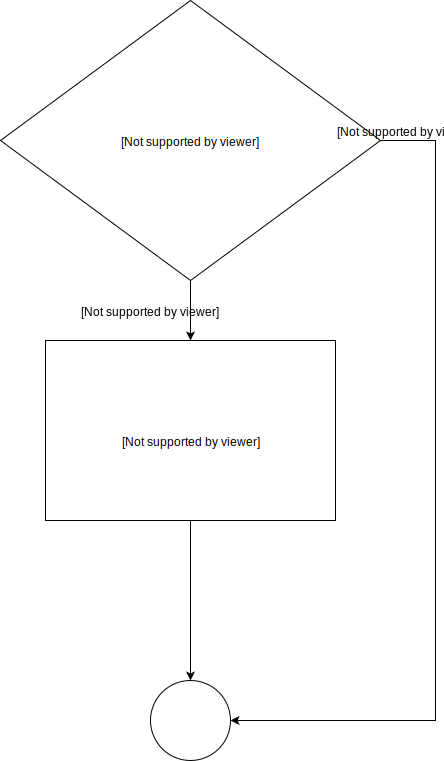
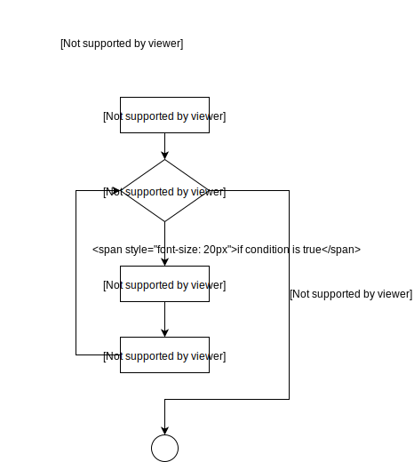
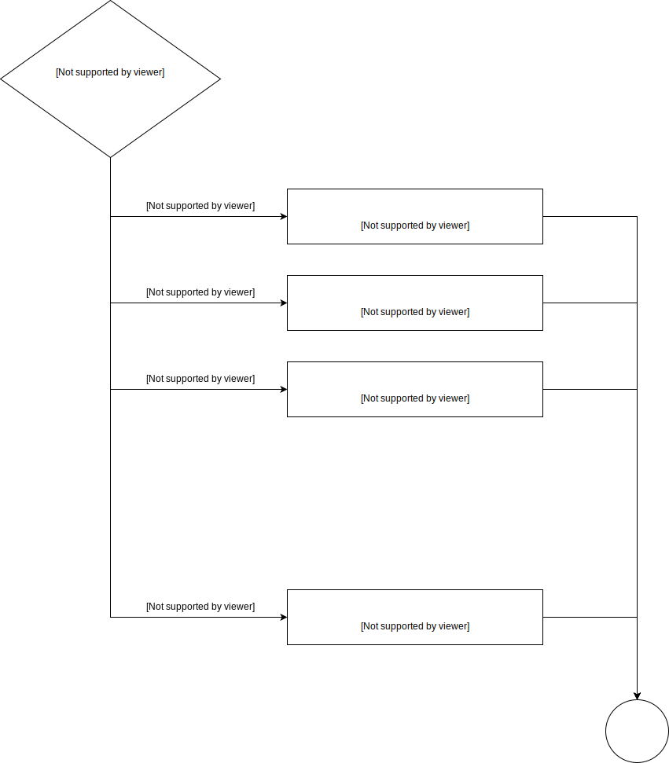
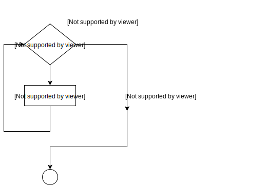

# Conditional process       

## if else if       

       

## for loop        

        

## switch        

        

Swich case statements can only be used with numbers, characters or Enums. They cannot be used for processing strings or classes.        

## while loop        

      

## Assignment      

                

Include all the specified functions in a file "assignment-2.c". Include a main
program that tests the functions by calling them with test data and printing the results returned 
by the functions. Include comments for the tests that describe their purposes.
Label the output so someone else can understand it. 

Provide a documentation block for for the file that includes the name of the file, its creation date, its author, and a brief description the file. Also provide a documentation block each function describing its purpose,
parameters, and return values as appropriate. Check your file in to the CCIS 
GitHub repository 2018FACS5001SV/assignment-2-<em>ccisID</em> that was created 
by your instructor for your ccisID.

<h4>Function <em>countCalls</em></h4>

Create a function <em>unsigned int countCalls(bool reset)</em> 
with a static unsigned in <em>problem1Count</em> to count the number of
times the function is called. If called with <em>false</em>, the function increments
<em>problem1Count</em> and returns 0. 
If called with <em>true</em>, the function resets <em>problem1Count</em> to 0 and 
returns the number of times the function was called since the last time it was reset.

 
Call this function from <em>main</em> several times with <em>false</em> to build up a
count, then call it with <em>true</em>. Report the value returned from the function 
for each call. By way of example, if the function is called four times with 
<em>false</em>, it returns 0 each time. If then called with <em>true</em>, it 
returns 4 and resets <em>problem1Count</em> back to 0.

 
    
<h4>Function pi</h4>

Write a function <em>double pi()</em> that approximates value of pi to the precision of a double:
3.14159265358979 using an approximation 
technique that is the sum of the series
 
3 + 4/(2*3*4) - 4/(4*5*6) + 4/(6*7*8) - 4/(8*9*10) ...

Use a loop to add successive tems of the series until the previous sum and sum with the next term are the same.  Return this value as the result of the function. 

<h4>Function <em>daysInMonth</em></h4>

Write a function <em>unsigned short daysInMonth(unsigned int month)</em>. The function
takes a month number between 1 (Janauary) and 12 (December), and uses a switch
statement to set a local unsigned short variable <em>numDays</em> to the number of days in any month (assuming 28 for February). Return <em>numDays</em> at the end of the function.  If the input value 
is not a valid month number, return 0 from the function. Be sure to include this behaviour in your function documenation.  

            

## Programming      

      

      

